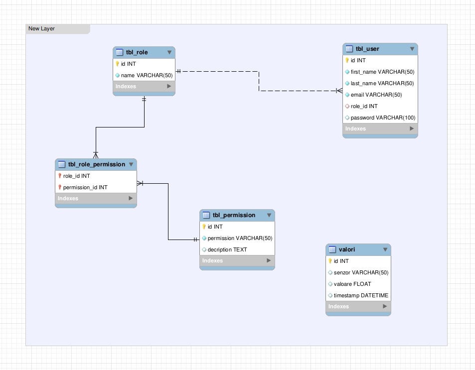
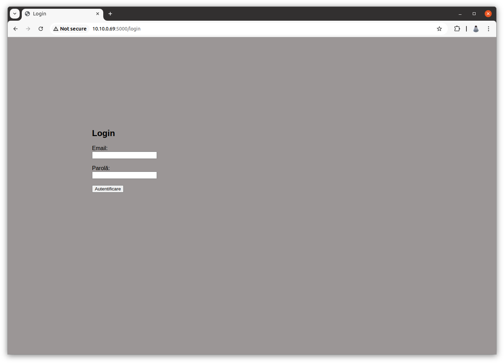
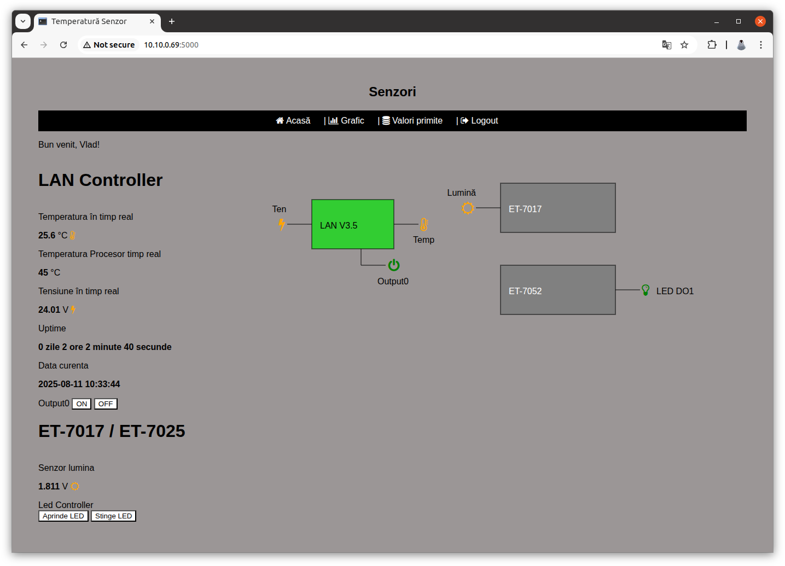
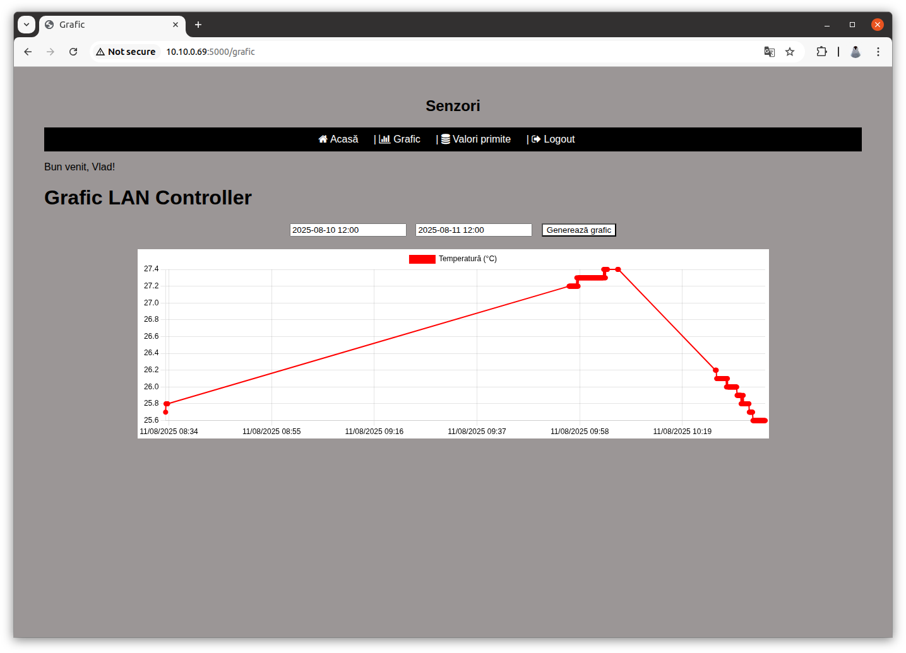
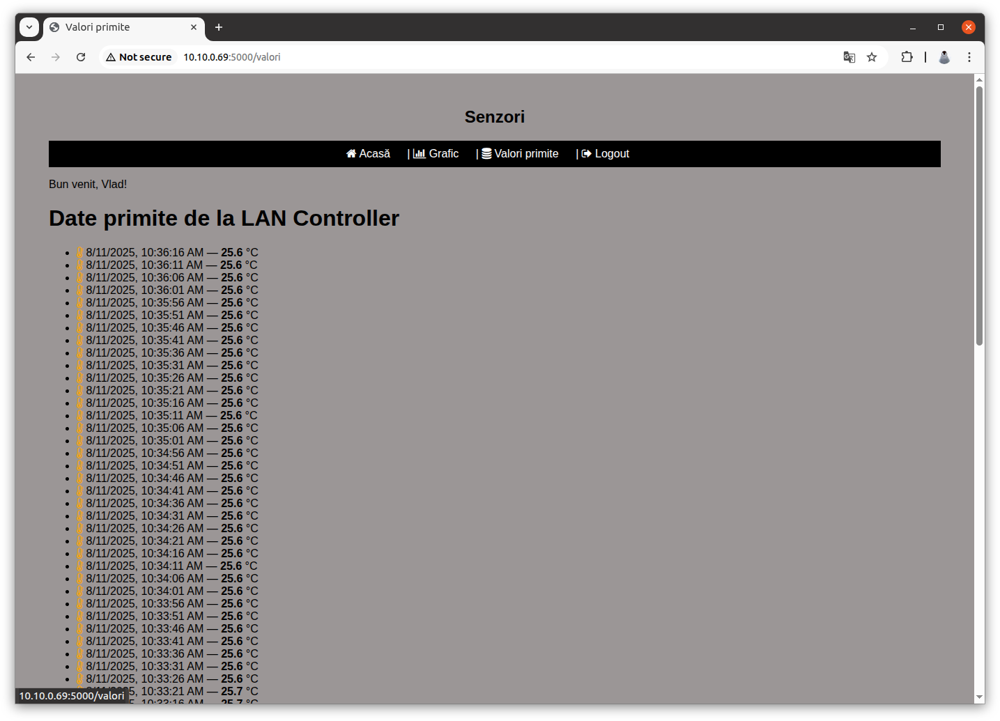

# 🖥️ IoT Web Application

This project is a web application for monitoring and controlling a set of sensors and actuators via LAN and Modbus devices such as ET-7017 and ET-7052. The frontend is a responsive interface that displays real-time data like temperature, voltage, uptime, and light levels, and allows the user to control outputs (such as LEDs and relays).

---

## 🚀 Features

- User login system with secure password hashing (bcrypt)
- Role-based permissions
- Data collection from analog/digital controllers (ET-7017, ET-7052)
- Real-time sensor display and logging
- Line chart visualization
- RESTful API endpoints for sensor and control access
- .env-based secure configuration
- MySQL database integration
- Flask-Login user session management

---

## 🔧 Used hardware

- [LAN Controller V3.5](https://tinycontrol.pl/media/documents/manual_LAN_Controller_V35_LANKON-008_EN.pdf)<br>The Lan Controller connects sensors, remotely views readings, controls outputs, and has a web interface for configuration and sensor readings.
- [ET-7017](https://www.icpdas.com/web/product/download/io_and_unit/ethernet/et7000_et7200/document/data_sheet/ET-7x17-10_PET-7x17-10_en.pdf)<br>The ET-7017 is a module with 8-channel differential analog inputs and 4-channel digital outputs. It provides programmable input range on all analog channels
- [ET-7052](https://www.icpdas.com/web/product/download/io_and_unit/ethernet/et7000_et7200/document/data_sheet/ET-7x52_PET-7x52_en.pdf)<br>The ET-7052 is a Ethernet I/O module with 8 DI/DO channels, built-in web server and Modbus support.

## 🧩 Techstack

- **Frontend**: 
    - HTML
    - CSS
    - [Font Awesome](https://fontawesome.com/)
    - JavaScript (Fetch API)

- **Backend**: 
    - [Python](https://www.python.org/) ([Flask](https://flask.palletsprojects.com/en/stable/))
    - [MySQL](https://www.mysql.com/)

---

## Database Model



>**Note** The database model is stored in `model.mwb`. You can import it into MySQL Workbench.

## ⚙️ Setup instructions

Install MySQL server if you do not already have one.
```bash
apt update
apt install mysql-server
```

Clone the repository on the server.
```bash
git clone https://github.com/your-username/sensor-web-app.git
cd sensor-web-app
```

Create and activate a virtual environment (optional but recommended)
```bash
python -m venv venv
source venv/bin/activate
```
>**Note** Windows users use `.\venv\Scripts\activate`.

Install dependencies.
```bash
pip install -r requirements.txt
```
Create the environment as `root`.

```bash
nano .env
---
DB_HOST=localhost
DB_USER=root
DB_PASSWORD=yourpassword
DB_NAME=sensordata
```

Complete the `config.json` file by entering the correct parameters (host, port, paths, etc.) for each controller.

Finally run the application.
```bash
python3 app.py
```
## Application preview




